# HRIS MVP - Entity Relationship Diagram

This ERD contains only the essential tables required for the HRIS MVP, focusing on core functionality for employee management, attendance, leave, payroll, and approval workflows.

## Mermaid ERD Diagram

```mermaid
erDiagram
    %% MASTER DATA
    COMPANIES ||--o{ DEPARTMENTS : has
    COMPANIES ||--o{ BRANCHES : has
    COMPANIES ||--o{ JOB_LEVELS : defines
    COMPANIES ||--o{ COMPANY_POLICIES : has
    COMPANIES ||--o{ LEAVE_TYPES : defines

    DEPARTMENTS ||--o{ POSITIONS : has
    DEPARTMENTS ||--o{ EMPLOYEES : contains

    BRANCHES ||--o{ EMPLOYEES : locates

    POSITIONS ||--o{ EMPLOYEES : assigned_to
    POSITIONS ||--o{ JOB_DESCRIPTIONS : has
    POSITIONS ||--o{ SALARY_STRUCTURES : has

    JOB_LEVELS ||--o{ POSITIONS : categorizes

    %% EMPLOYEE MANAGEMENT
    EMPLOYEES ||--o{ EMPLOYEE_CONTRACTS : has
    EMPLOYEES ||--o{ EMPLOYEE_FAMILIES : has
    EMPLOYEES ||--o{ EMPLOYEE_EDUCATIONS : has
    EMPLOYEES ||--o{ EMPLOYEE_EXPERIENCES : has
    EMPLOYEES ||--o{ EMPLOYEE_DOCUMENTS : has
    EMPLOYEES ||--o{ EMPLOYEE_COMPETENCIES : has
    EMPLOYEES ||--o{ BANK_ACCOUNTS : has

    %% ATTENDANCE & TIME MANAGEMENT
    EMPLOYEES ||--o{ ATTENDANCES : records
    EMPLOYEES ||--o{ OVERTIME_REQUESTS : submits

    %% LEAVE MANAGEMENT
    EMPLOYEES ||--o{ LEAVE_BALANCES : has
    EMPLOYEES ||--o{ LEAVE_REQUESTS : submits

    LEAVE_TYPES ||--o{ LEAVE_BALANCES : categorizes
    LEAVE_TYPES ||--o{ LEAVE_REQUESTS : categorizes
    LEAVE_TYPES ||--o{ LEAVE_POLICIES : has

    %% PAYROLL
    EMPLOYEES ||--o{ PAYROLL_RECORDS : receives
    EMPLOYEES ||--o{ SALARY_ADJUSTMENTS : has
    EMPLOYEES ||--o{ LOAN_REQUESTS : submits
    EMPLOYEES ||--o{ REIMBURSEMENTS : claims

    PAYROLL_RECORDS ||--o{ PAYROLL_COMPONENTS : contains
    PAYROLL_RECORDS ||--o{ PAYROLL_DEDUCTIONS : has

    PAYROLL_COMPONENTS }o--|| COMPONENT_TYPES : uses
    PAYROLL_DEDUCTIONS }o--|| DEDUCTION_TYPES : uses

    SALARY_STRUCTURES ||--o{ SALARY_COMPONENTS : defines

    %% APPROVAL WORKFLOWS
    APPROVAL_WORKFLOWS ||--o{ APPROVAL_STEPS : defines
    APPROVAL_STEPS ||--o{ APPROVAL_LOGS : tracks

    LEAVE_REQUESTS ||--o{ APPROVAL_LOGS : requires
    OVERTIME_REQUESTS ||--o{ APPROVAL_LOGS : requires
    LOAN_REQUESTS ||--o{ APPROVAL_LOGS : requires
    REIMBURSEMENTS ||--o{ APPROVAL_LOGS : requires

    EMPLOYEES ||--o{ APPROVAL_LOGS : approves

    %% ORGANIZATIONAL
    EMPLOYEES }o--|| EMPLOYEES : reports_to

    %% ANNOUNCEMENT & COMMUNICATION
    ANNOUNCEMENTS ||--o{ ANNOUNCEMENT_READS : tracked_by
    EMPLOYEES ||--o{ ANNOUNCEMENT_READS : reads

    COMPANIES {
        int id PK
        string company_name
        string company_code
        string tax_id
        string address
        string phone
        string email
        date established_date
        boolean is_active
    }

    BRANCHES {
        int id PK
        int company_id FK
        string branch_name
        string branch_code
        string address
        string city
        string province
        string postal_code
        string phone
        boolean is_head_office
        boolean is_active
    }

    DEPARTMENTS {
        int id PK
        int company_id FK
        int parent_department_id FK
        string department_name
        string department_code
        int head_employee_id FK
        boolean is_active
    }

    POSITIONS {
        int id PK
        int department_id FK
        int job_level_id FK
        string position_name
        string position_code
        int reports_to_position_id FK
        int min_salary
        int max_salary
        boolean is_active
    }

    JOB_LEVELS {
        int id PK
        int company_id FK
        string level_name
        int level_order
        string description
    }

    JOB_DESCRIPTIONS {
        int id PK
        int position_id FK
        text responsibilities
        text requirements
        text qualifications
        date effective_date
        boolean is_active
    }

    EMPLOYEES {
        int id PK
        string employee_number UK
        string first_name
        string last_name
        string email UK
        string phone
        date birth_date
        string gender
        string marital_status
        string id_number
        string tax_id
        int position_id FK
        int department_id FK
        int branch_id FK
        int manager_id FK
        string employment_status
        date join_date
        date permanent_date
        date resignation_date
        string photo_url
        boolean is_active
    }

    EMPLOYEE_CONTRACTS {
        int id PK
        int employee_id FK
        string contract_type
        date start_date
        date end_date
        int salary_amount
        text terms_conditions
        string status
    }

    EMPLOYEE_FAMILIES {
        int id PK
        int employee_id FK
        string relationship
        string full_name
        date birth_date
        string id_number
        boolean is_emergency_contact
    }

    EMPLOYEE_EDUCATIONS {
        int id PK
        int employee_id FK
        string degree_level
        string institution
        string major
        int graduation_year
        string certificate_url
    }

    EMPLOYEE_EXPERIENCES {
        int id PK
        int employee_id FK
        string company_name
        string position
        date start_date
        date end_date
        text job_description
    }

    EMPLOYEE_DOCUMENTS {
        int document_id PK
        int employee_id FK
        string document_type
        string document_name
        string file_url
        date upload_date
        date expiry_date
    }

    EMPLOYEE_COMPETENCIES {
        int id PK
        int employee_id FK
        string competency_name
        string competency_type
        int proficiency_level
        date assessment_date
    }

    BANK_ACCOUNTS {
        int id PK
        int employee_id FK
        string bank_name
        string account_number
        string account_holder_name
        boolean is_primary
    }

    ATTENDANCES {
        int id PK
        int employee_id FK
        date attendance_date
        time check_in
        time check_out
        string location_in
        string location_out
        string status
        text notes
    }

    OVERTIME_REQUESTS {
        int id PK
        int employee_id FK
        date overtime_date
        time start_time
        time end_time
        decimal hours
        text reason
        string status
        datetime created_at
    }

    LEAVE_TYPES {
        int id PK
        int company_id FK
        string leave_name
        int annual_quota
        boolean is_paid
        boolean requires_document
        int max_consecutive_days
        boolean is_active
    }

    LEAVE_POLICIES {
        int id PK
        int leave_type_id FK
        text policy_rules
        int notice_period_days
        date effective_date
    }

    LEAVE_BALANCES {
        int id PK
        int employee_id FK
        int leave_type_id FK
        int year
        int entitled
        int used
        int remaining
    }

    LEAVE_REQUESTS {
        int id PK
        int employee_id FK
        int leave_type_id FK
        date start_date
        date end_date
        decimal total_days
        text reason
        string document_url
        string status
        datetime created_at
    }

    SALARY_STRUCTURES {
        int id PK
        int position_id FK
        int base_salary
        date effective_date
        boolean is_active
    }

    SALARY_COMPONENTS {
        int id PK
        int structure_id FK
        int component_type_id FK
        string component_name
        decimal amount
        string calculation_type
        boolean is_taxable
    }

    COMPONENT_TYPES {
        int id PK
        string type_name
        string category
        boolean is_recurring
    }

    PAYROLL_RECORDS {
        int payroll_id PK
        int employee_id FK
        int period_month
        int period_year
        date payment_date
        decimal gross_salary
        decimal total_deductions
        decimal net_salary
        string status
        datetime processed_at
    }

    PAYROLL_COMPONENTS {
        int pc_id PK
        int payroll_id FK
        int component_type_id FK
        string component_name
        decimal amount
        boolean is_taxable
    }

    PAYROLL_DEDUCTIONS {
        int deduction_id PK
        int payroll_id FK
        int deduction_type_id FK
        string deduction_name
        decimal amount
    }

    DEDUCTION_TYPES {
        int deduction_type_id PK
        string type_name
        string category
        boolean is_mandatory
    }

    SALARY_ADJUSTMENTS {
        int adjustment_id PK
        int employee_id FK
        date effective_date
        decimal old_salary
        decimal new_salary
        decimal adjustment_percentage
        string adjustment_type
        text reason
        int approved_by FK
    }

    LOAN_REQUESTS {
        int loan_id PK
        int employee_id FK
        decimal loan_amount
        int installment_months
        decimal installment_amount
        date start_date
        decimal outstanding_balance
        string status
        text purpose
        datetime created_at
    }

    REIMBURSEMENTS {
        int reimbursement_id PK
        int employee_id FK
        string reimbursement_type
        date expense_date
        decimal amount
        text description
        string receipt_url
        string status
        datetime created_at
    }

    APPROVAL_WORKFLOWS {
        int id PK
        int company_id FK
        string workflow_name
        string entity_type
        text conditions
        boolean is_active
    }

    APPROVAL_STEPS {
        int step_id PK
        int workflow_id FK
        int step_order
        string approver_type
        int approver_id FK
        boolean is_required
        int escalation_hours
    }

    APPROVAL_LOGS {
        int id PK
        int workflow_id FK
        int step_id FK
        string entity_type
        int entity_id
        int approver_id FK
        string action
        text comments
        datetime action_datetime
    }

    ANNOUNCEMENTS {
        int announcement_id PK
        int company_id FK
        string title
        text content
        string priority
        date publish_date
        date expiry_date
        int created_by FK
        boolean is_active
    }

    ANNOUNCEMENT_READS {
        int read_id PK
        int announcement_id FK
        int employee_id FK
        datetime read_at
    }

    COMPANY_POLICIES {
        int id PK
        int company_id FK
        string policy_name
        string policy_category
        text policy_content
        date effective_date
        int version
        boolean is_active
    }
```

## Changes Summary

### Tables Removed from Original ERD

The following tables have been removed from the MVP as they represent features planned for Phase 2 or later releases:

#### 1. Shift Management (3 tables removed)
- **SHIFTS** - Shift definition and scheduling
- **SHIFT_ASSIGNMENTS** - Employee shift assignments
- **SHIFT_SCHEDULES** - Shift calendar and schedules

**Rationale**: Shift management is explicitly marked as a Phase 2 feature in the MVP scope. The basic attendance system will work with standard work hours without shift configurations.

#### 2. Performance Management (6 tables removed)
- **PERFORMANCE_REVIEWS** - Employee performance evaluations
- **REVIEW_PERIODS** - Review cycle definitions
- **REVIEW_DETAILS** - Detailed performance criteria and ratings
- **KPI_TEMPLATES** - Key Performance Indicator templates
- **KPI_ASSIGNMENTS** - Employee KPI assignments and tracking
- **GOALS** - Employee goal setting and tracking

**Rationale**: Performance management is not part of the core MVP features. The system focuses on operational HR tasks (attendance, leave, payroll) rather than performance evaluation.

#### 3. Recruitment (5 tables removed)
- **JOB_POSTINGS** - Job vacancy postings
- **CANDIDATES** - Candidate information
- **APPLICATIONS** - Job applications
- **INTERVIEWS** - Interview scheduling and records
- **APPLICATION_ASSESSMENTS** - Candidate assessments

**Rationale**: Recruitment is a separate module not included in the MVP scope. The MVP focuses on managing existing employees, not hiring new ones.

#### 4. Training & Development (5 tables removed)
- **TRAINING_PROGRAMS** - Training program definitions
- **TRAINING_SESSIONS** - Scheduled training sessions
- **TRAINING_PARTICIPANTS** - Training enrollment and attendance
- **TRAINING_EVALUATIONS** - Training effectiveness evaluations
- **TRAINING_REQUESTS** - Employee training requests

**Rationale**: Training management is not a core MVP requirement and adds significant complexity. This can be added in future phases.

#### 5. Career Development (4 tables removed)
- **PROMOTIONS** - Employee promotion records
- **TRANSFERS** - Department/branch transfer records
- **CAREER_PATHS** - Career development planning
- **SUCCESSION_PLANS** - Succession planning records

**Rationale**: Career development features are strategic HR functions not required for the basic operational MVP.

#### 6. Disciplinary Management (2 tables removed)
- **DISCIPLINARY_ACTIONS** - Disciplinary action records
- **WARNINGS** - Warning and violation records

**Rationale**: While important, disciplinary management can be handled manually or added in later phases. Not critical for MVP launch.

#### 7. Benefits Management (2 tables removed)
- **BENEFIT_PLANS** - Employee benefit plan definitions
- **BENEFIT_ENROLLMENTS** - Benefit enrollment records

**Rationale**: Benefits management adds complexity and is not part of the core payroll processing in the MVP.

#### 8. Asset Management (3 tables removed)
- **ASSET_CATEGORIES** - Asset categorization
- **ASSETS** - Company asset inventory
- **EMPLOYEE_ASSETS** - Asset assignment to employees

**Rationale**: Asset management is a separate concern from core HR operations and can be implemented in future phases.

#### 9. Employee Self Service (2 tables removed)
- **PROFILE_CHANGE_REQUESTS** - Employee profile change workflows
- **TIME_OFF_REQUESTS** - Short-term time off requests

**Rationale**: Basic profile changes can be handled through direct updates or manual approval. TIME_OFF_REQUESTS is redundant with LEAVE_REQUESTS for the MVP.

### MVP Core Tables (32 tables retained)

The MVP retains 32 essential tables organized into the following categories:

#### Master Data (7 tables)
- COMPANIES - Multi-company support
- BRANCHES - Office/branch locations
- DEPARTMENTS - Department hierarchy
- POSITIONS - Job positions
- JOB_LEVELS - Position levels
- JOB_DESCRIPTIONS - Position responsibilities
- COMPANY_POLICIES - Company policy documents

#### Employee Management (8 tables)
- EMPLOYEES - Core employee records
- EMPLOYEE_CONTRACTS - Employment contracts
- EMPLOYEE_FAMILIES - Family and emergency contacts
- EMPLOYEE_EDUCATIONS - Education history
- EMPLOYEE_EXPERIENCES - Work experience
- EMPLOYEE_DOCUMENTS - Document storage
- EMPLOYEE_COMPETENCIES - Skills and competencies
- BANK_ACCOUNTS - Payroll bank accounts

#### Attendance (2 tables)
- ATTENDANCES - GPS-based attendance records
- OVERTIME_REQUESTS - Overtime request and tracking

#### Leave Management (4 tables)
- LEAVE_TYPES - Leave type definitions
- LEAVE_POLICIES - Leave policy rules
- LEAVE_BALANCES - Employee leave balance tracking
- LEAVE_REQUESTS - Leave request workflows

#### Payroll (9 tables)
- SALARY_STRUCTURES - Position-based salary structures
- SALARY_COMPONENTS - Salary component definitions
- COMPONENT_TYPES - Component categorization
- PAYROLL_RECORDS - Monthly payroll processing
- PAYROLL_COMPONENTS - Payroll earnings breakdown
- PAYROLL_DEDUCTIONS - Payroll deductions (tax, BPJS)
- DEDUCTION_TYPES - Deduction categorization
- SALARY_ADJUSTMENTS - Salary change history
- LOAN_REQUESTS - Employee loan management
- REIMBURSEMENTS - Expense reimbursements

#### Approval Workflows (3 tables)
- APPROVAL_WORKFLOWS - Configurable workflow definitions
- APPROVAL_STEPS - Multi-level approval steps
- APPROVAL_LOGS - Approval audit trail

#### Communication (2 tables)
- ANNOUNCEMENTS - Company announcements
- ANNOUNCEMENT_READS - Read receipt tracking

### Key Design Principles

1. **Focus on Core Operations**: The MVP ERD focuses exclusively on essential HR operations: employee data, attendance tracking, leave management, and payroll processing.

2. **Simplified Workflows**: Approval workflows are maintained but simplified to support core request types (leave, overtime, loans, reimbursements).

3. **Scalability**: The retained tables provide a solid foundation that can be extended with Phase 2 features without requiring major schema changes.

4. **Data Integrity**: All critical relationships are maintained, including employee hierarchies, organizational structure, and approval chains.

5. **Compliance Ready**: Essential compliance-related data (tax ID, BPJS, contracts, documents) are retained for legal and regulatory requirements.

### Total Table Count
- **Original ERD**: 63 tables
- **MVP ERD**: 32 tables
- **Tables Removed**: 31 tables (49% reduction)

This simplified structure allows for faster development, easier testing, and quicker time-to-market while maintaining all core HRIS functionality required for daily operations.
