# HRIS MVP - Entity Relationship Diagram

This ERD contains only the essential tables required for the HRIS, focusing on core functionality for employee management, attendance, leave, payroll, and approval workflows.

## Mermaid ERD Diagram

```mermaid
erDiagram
    %% MASTER DATA
    COMPANIES ||--o{ BRANCHES : has

    DEPARTMENTS ||--o{ POSITIONS : has
    DEPARTMENTS ||--o{ EMPLOYEES : contains
    DEPARTMENTS }o--o| EMPLOYEES : headed_by

    BRANCHES ||--o{ EMPLOYEES : locates

    POSITIONS ||--o{ EMPLOYEES : assigned_to
    POSITIONS ||--o{ JOB_DESCRIPTIONS : has
    POSITIONS ||--o{ SALARY_STRUCTURES : has

    JOB_LEVELS ||--o{ POSITIONS : categorizes

    %% EMPLOYEE MANAGEMENT
    EMPLOYEES ||--o{ EMPLOYEE_CONTRACTS : has
    EMPLOYEES ||--o{ BANK_ACCOUNTS : has
    EMPLOYEES ||--o{ ANNOUNCEMENTS : creates
    EMPLOYEES ||--o{ APPROVAL_LOGS : performs

    %% ATTENDANCE & TIME MANAGEMENT
    EMPLOYEES ||--o{ ATTENDANCES : records
    EMPLOYEES ||--o{ OVERTIME_REQUESTS : submits

    %% LEAVE MANAGEMENT
    EMPLOYEES ||--o{ LEAVE_BALANCES : has
    EMPLOYEES ||--o{ LEAVE_REQUESTS : submits

    LEAVE_TYPES ||--o{ LEAVE_BALANCES : categorizes
    LEAVE_TYPES ||--o{ LEAVE_REQUESTS : categorizes
    LEAVE_TYPES ||--o{ LEAVE_POLICIES : has

    %% PAYROLL
    EMPLOYEES ||--o{ PAYROLL_RECORDS : receives
    EMPLOYEES ||--o{ REIMBURSEMENTS : claims

    PAYROLL_RECORDS ||--o{ PAYROLL_COMPONENTS : contains
    PAYROLL_RECORDS ||--o{ PAYROLL_DEDUCTIONS : has

    PAYROLL_COMPONENTS }o--|| COMPONENT_TYPES : uses
    PAYROLL_DEDUCTIONS }o--|| DEDUCTION_TYPES : uses

    SALARY_STRUCTURES ||--o{ SALARY_COMPONENTS : defines

    %% APPROVAL WORKFLOWS
    APPROVAL_WORKFLOWS ||--o{ APPROVAL_STEPS : defines
    APPROVAL_STEPS ||--o{ APPROVAL_LOGS : tracks

    LEAVE_REQUESTS ||--o{ APPROVAL_LOGS : requires
    OVERTIME_REQUESTS ||--o{ APPROVAL_LOGS : requires
    REIMBURSEMENTS ||--o{ APPROVAL_LOGS : requires

    %% ANNOUNCEMENT & COMMUNICATION
    ANNOUNCEMENTS ||--o{ ANNOUNCEMENT_READS : tracked_by
    EMPLOYEES ||--o{ ANNOUNCEMENT_READS : reads

    COMPANIES {
        int id PK
        string company_name "NOT NULL"
        string company_code "UNIQUE, NOT NULL"
        string tax_id "UNIQUE"
        string address
        string phone
        string email "UNIQUE"
        date established_date
        boolean is_active "DEFAULT true"
        datetime created_at
        datetime updated_at
    }

    BRANCHES {
        int id PK
        int company_id FK "NOT NULL"
        string branch_name "NOT NULL"
        string branch_code "UNIQUE, NOT NULL"
        string address
        string city
        string province
        string postal_code
        string phone
        boolean is_head_office "DEFAULT false"
        boolean is_active "DEFAULT true"
        datetime created_at
        datetime updated_at
    }

    DEPARTMENTS {
        int id PK
        int parent_department_id FK "NULL, SELF-REF"
        string department_name "NOT NULL"
        string department_code "UNIQUE, NOT NULL"
        int head_employee_id FK "NULL"
        boolean is_active "DEFAULT true"
        datetime created_at
        datetime updated_at
    }

    POSITIONS {
        int id PK
        int department_id FK "NOT NULL"
        int job_level_id FK "NOT NULL"
        string position_name "NOT NULL"
        string position_code "UNIQUE, NOT NULL"
        int reports_to_position_id FK "NULL, SELF-REF"
        decimal min_salary "CHECK >= 0"
        decimal max_salary "CHECK >= min_salary"
        boolean is_active "DEFAULT true"
        datetime created_at
        datetime updated_at
    }

    JOB_LEVELS {
        int id PK
        string level_name "NOT NULL"
        int level_order "UNIQUE per company"
        string description
        datetime created_at
        datetime updated_at
    }

    JOB_DESCRIPTIONS {
        int id PK
        int position_id FK "NOT NULL"
        text responsibilities
        text requirements
        text qualifications
        date effective_date "NOT NULL"
        boolean is_active "DEFAULT true"
        datetime created_at
        datetime updated_at
    }

    EMPLOYEES {
        int id PK
        string employee_number "UNIQUE, NOT NULL"
        string first_name "NOT NULL"
        string last_name "NOT NULL"
        string email "UNIQUE, NOT NULL"
        string phone
        date birth_date
        string gender "CHECK IN (M,F,Other)"
        string marital_status "CHECK IN values"
        string id_number "UNIQUE"
        string tax_id "UNIQUE"
        int position_id FK "NOT NULL"
        int department_id FK "NOT NULL"
        int branch_id FK "NOT NULL"
        int manager_employee_id FK "NULL, SELF-REF"
        string employment_status "NOT NULL"
        date join_date "NOT NULL"
        date permanent_date
        date resignation_date
        string photo_url
        boolean is_active "DEFAULT true"
        _string user_roles "CHECK IN (ADMIN, EMPLOYEE)"
        string user_password_hash "NOT NULL"
        datetime user_last_activity_at
        datetime created_at
        datetime updated_at
    }

    EMPLOYEE_CONTRACTS {
        int id PK
        int employee_id FK "NOT NULL"
        string contract_type "NOT NULL"
        date start_date "NOT NULL"
        date end_date
        decimal salary_amount "NOT NULL"
        text terms_conditions
        string status "NOT NULL"
        datetime created_at
        datetime updated_at
    }

    BANK_ACCOUNTS {
        int id PK
        int employee_id FK "NOT NULL"
        string bank_name "NOT NULL"
        string account_number "NOT NULL"
        string account_holder_name "NOT NULL"
        boolean is_primary "DEFAULT false"
        datetime created_at
        datetime updated_at
    }

    ATTENDANCES {
        int id PK
        int employee_id FK "NOT NULL"
        date attendance_date "NOT NULL"
        time check_in
        time check_out
        string location_in
        string location_out
        string status "NOT NULL"
        text notes
        datetime created_at
        datetime updated_at
    }

    OVERTIME_REQUESTS {
        int id PK
        int employee_id FK "NOT NULL"
        date overtime_date "NOT NULL"
        time start_time "NOT NULL"
        time end_time "NOT NULL"
        decimal hours "COMPUTED"
        text reason
        string status "NOT NULL, DEFAULT pending"
        datetime created_at
        datetime updated_at
    }

    LEAVE_TYPES {
        int id PK
        string leave_name "NOT NULL"
        int annual_quota "DEFAULT 0"
        boolean is_paid "DEFAULT true"
        boolean requires_document "DEFAULT false"
        int max_consecutive_days
        boolean is_active "DEFAULT true"
        datetime created_at
        datetime updated_at
    }

    LEAVE_POLICIES {
        int id PK
        int leave_type_id FK "NOT NULL"
        text policy_rules
        int notice_period_days "DEFAULT 0"
        date effective_date "NOT NULL"
        datetime created_at
        datetime updated_at
    }

    LEAVE_BALANCES {
        int id PK
        int employee_id FK "NOT NULL"
        int leave_type_id FK "NOT NULL"
        int year "NOT NULL"
        int entitled "DEFAULT 0"
        int used "DEFAULT 0"
        int remaining "COMPUTED"
        datetime created_at
        datetime updated_at
    }

    LEAVE_REQUESTS {
        int id PK
        int employee_id FK "NOT NULL"
        int leave_type_id FK "NOT NULL"
        date start_date "NOT NULL"
        date end_date "NOT NULL"
        decimal total_days "COMPUTED"
        text reason
        string document_url
        string status "NOT NULL, DEFAULT pending"
        datetime created_at
        datetime updated_at
    }

    SALARY_STRUCTURES {
        int id PK
        int position_id FK "NOT NULL"
        decimal base_salary "NOT NULL"
        date effective_date "NOT NULL"
        boolean is_active "DEFAULT true"
        datetime created_at
        datetime updated_at
    }

    SALARY_COMPONENTS {
        int id PK
        int structure_id FK "NOT NULL"
        int component_type_id FK "NOT NULL"
        string component_name "NOT NULL"
        decimal amount "NOT NULL"
        string calculation_type "NOT NULL"
        boolean is_taxable "DEFAULT false"
        datetime created_at
        datetime updated_at
    }

    COMPONENT_TYPES {
        int id PK
        string type_name "UNIQUE, NOT NULL"
        string category "NOT NULL"
        boolean is_recurring "DEFAULT true"
        datetime created_at
        datetime updated_at
    }

    PAYROLL_RECORDS {
        int id PK
        int employee_id FK "NOT NULL"
        int period_month "CHECK 1-12"
        int period_year "NOT NULL"
        date payment_date
        decimal gross_salary "NOT NULL"
        decimal total_deductions "DEFAULT 0"
        decimal net_salary "COMPUTED"
        string status "NOT NULL"
        datetime processed_at
        datetime created_at
        datetime updated_at
    }

    PAYROLL_COMPONENTS {
        int id PK
        int payroll_id FK "NOT NULL"
        int component_type_id FK "NOT NULL"
        string component_name "NOT NULL"
        decimal amount "NOT NULL"
        boolean is_taxable "DEFAULT false"
        datetime created_at
        datetime updated_at
    }

    PAYROLL_DEDUCTIONS {
        int id PK
        int payroll_id FK "NOT NULL"
        int deduction_type_id FK "NOT NULL"
        string deduction_name "NOT NULL"
        decimal amount "NOT NULL"
        datetime created_at
        datetime updated_at
    }

    DEDUCTION_TYPES {
        int id PK
        string type_name "UNIQUE, NOT NULL"
        string category "NOT NULL"
        boolean is_mandatory "DEFAULT false"
        datetime created_at
        datetime updated_at
    }

    REIMBURSEMENTS {
        int id PK
        int employee_id FK "NOT NULL"
        string reimbursement_type "NOT NULL"
        date expense_date "NOT NULL"
        decimal amount "NOT NULL"
        text description
        string receipt_url
        string status "NOT NULL, DEFAULT pending"
        datetime created_at
        datetime updated_at
    }

    APPROVAL_WORKFLOWS {
        int id PK
        string workflow_name "NOT NULL"
        string entity_type "NOT NULL"
        text conditions
        boolean is_active "DEFAULT true"
        datetime created_at
        datetime updated_at
    }

    APPROVAL_STEPS {
        int id PK
        int approval_workflow_id FK "NOT NULL"
        int step_order "NOT NULL"
        string approver_type "NOT NULL"
        int approver_id FK "NULL"
        boolean is_required "DEFAULT true"
        int escalation_hours "DEFAULT 24"
        datetime created_at
        datetime updated_at
    }

    APPROVAL_LOGS {
        int id PK
        int approval_workflow_id FK "NOT NULL"
        int step_id FK "NOT NULL"
        string entity_type "NOT NULL"
        int entity_id "NOT NULL"
        int approver_id FK "NOT NULL, REF EMPLOYEES"
        string action "NOT NULL"
        text comments
        datetime action_datetime "NOT NULL"
        datetime created_at
    }

    ANNOUNCEMENTS {
        int id PK
        string title "NOT NULL"
        text content "NOT NULL"
        string priority "DEFAULT normal"
        date publish_date "NOT NULL"
        date expiry_date
        int created_by FK "NOT NULL, REF EMPLOYEES"
        boolean is_active "DEFAULT true"
        datetime created_at
        datetime updated_at
    }

    ANNOUNCEMENT_READS {
        int id PK
        int announcement_id FK "NOT NULL"
        int employee_id FK "NOT NULL"
        datetime read_at "NOT NULL"
    }

    COMPANY_POLICIES {
        int id PK
        string policy_name "NOT NULL"
        string policy_category "NOT NULL"
        text policy_content "NOT NULL"
        date effective_date "NOT NULL"
        int version "DEFAULT 1"
        boolean is_active "DEFAULT true"
        datetime created_at
        datetime updated_at
    }
```

