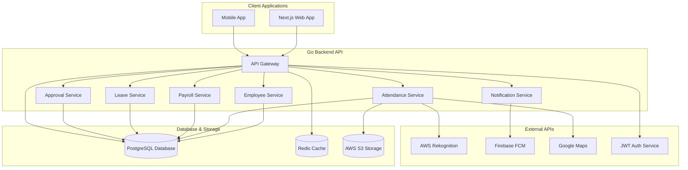
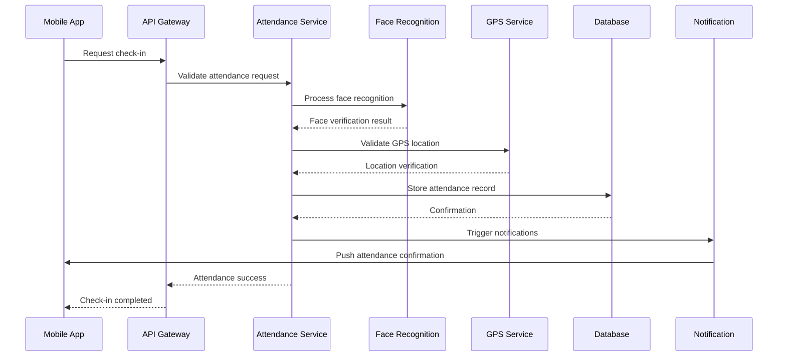
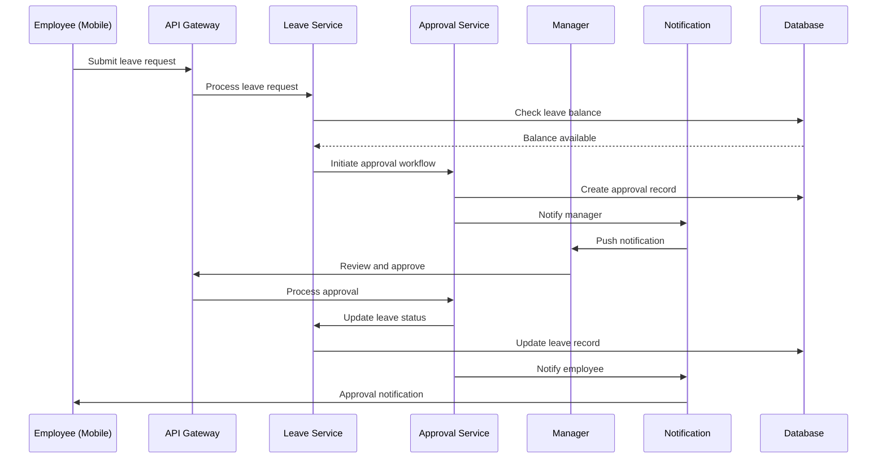
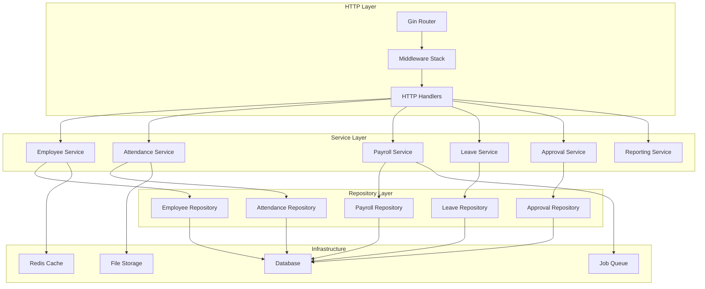
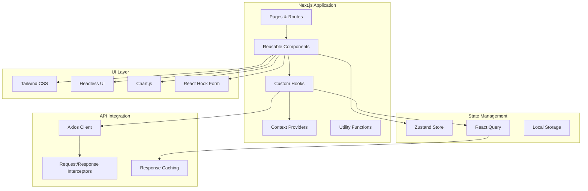
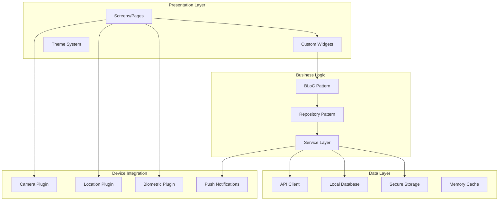
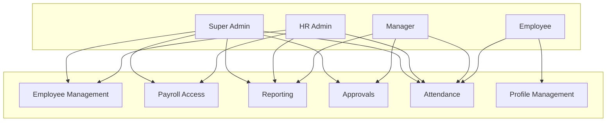
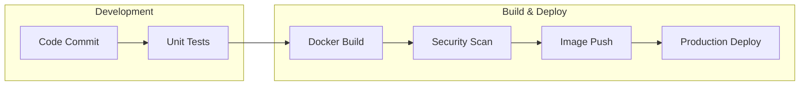
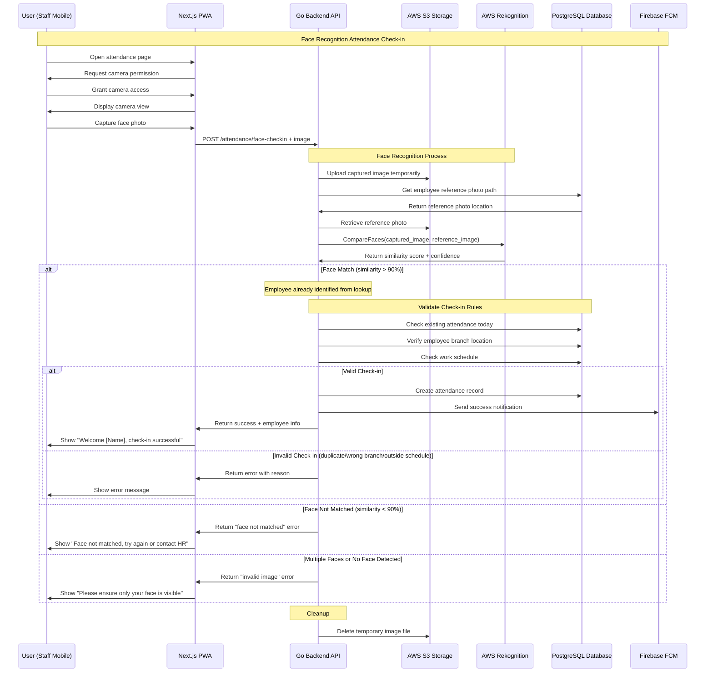

# Human Resource Information System (HRIS) Engineering Specification

## Table of Contents
- [Human Resource Information System (HRIS) Engineering Specification](#human-resource-information-system-hris-engineering-specification)
  - [Table of Contents](#table-of-contents)
  - [Executive Summary](#executive-summary)
  - [Background](#background)
    - [Problem Statement](#problem-statement)
    - [Solution Overview](#solution-overview)
  - [User Stories](#user-stories)
    - [Admin/HR Role](#adminhr-role)
    - [Manager/Supervisor Role](#managersupervisor-role)
    - [Employee Role](#employee-role)
  - [System Modules](#system-modules)
  - [Technology Stack](#technology-stack)
    - [Communication Layer](#communication-layer)
    - [Processing \& Service Layer](#processing--service-layer)
    - [Presentation Layer](#presentation-layer)
    - [Data Layer](#data-layer)
    - [Infrastructure Layer](#infrastructure-layer)
  - [System Architecture](#system-architecture)
    - [High-Level Architecture](#high-level-architecture)
    - [Data Flow Sequence](#data-flow-sequence)
      - [Attendance Check-in Flow](#attendance-check-in-flow)
      - [Leave Request Approval Flow](#leave-request-approval-flow)
  - [Component Specifications](#component-specifications)
    - [Go Backend Services](#go-backend-services)
      - [Architecture Overview](#architecture-overview)
      - [Core Services Specifications](#core-services-specifications)
      - [API Design Standards](#api-design-standards)
    - [Next.js Frontend Application](#nextjs-frontend-application)
      - [Frontend Architecture](#frontend-architecture)
      - [Key Features](#key-features)
      - [Page Structure](#page-structure)
    - [Flutter Mobile Application](#flutter-mobile-application)
      - [Mobile Architecture](#mobile-architecture)
      - [Core Features](#core-features)
      - [Key Screens](#key-screens)
  - [Security Architecture](#security-architecture)
    - [Authentication \& Authorization](#authentication--authorization)
      - [Multi-layered Authentication](#multi-layered-authentication)
      - [Role-Based Access Control (RBAC)](#role-based-access-control-rbac)
    - [Data Security](#data-security)
      - [Encryption Standards](#encryption-standards)
      - [Privacy Compliance](#privacy-compliance)
    - [System Security](#system-security)
      - [Application Security](#application-security)
      - [Infrastructure Security](#infrastructure-security)
  - [Deployment Strategy](#deployment-strategy)
    - [Server Specifications](#server-specifications)
      - [Production/Development Environment (1000+ Users)](#productiondevelopment-environment-1000-users)
    - [**Total Infrastructure Cost Summary**](#total-infrastructure-cost-summary)
      - [Second Option](#second-option)
    - [CI/CD Pipeline](#cicd-pipeline)
      - [Development Workflow](#development-workflow)
      - [Pipeline Stages](#pipeline-stages)
      - [Monitoring and Alerting](#monitoring-and-alerting)
  - [Face Recognition Attendance System](#face-recognition-attendance-system)
    - [AWS Rekognition Implementation](#aws-rekognition-implementation)
    - [Mobile Face Recognition Attendance Flow](#mobile-face-recognition-attendance-flow)
    - [Web-Based Attendance Support](#web-based-attendance-support)
    - [Kiosk Attendance Support](#kiosk-attendance-support)
  - [Appendix](#appendix)
    - [Face Recognition Technology](#face-recognition-technology)
      - [Technology Options](#technology-options)
      - [Recommended Approach](#recommended-approach)
    - [Maps and Location Services](#maps-and-location-services)
      - [GPS and Location Requirements](#gps-and-location-requirements)
      - [Technology Options](#technology-options-1)
      - [Implementation Strategy](#implementation-strategy)
    - [Glossary](#glossary)

---

## Executive Summary

This document defines the engineering specification for a comprehensive Human Resource Information System (HRIS) that manages employee lifecycle, attendance tracking, payroll processing, and organizational workflows. The system is designed to handle 1000+ concurrent users with scalable architecture supporting web and mobile platforms.

The HRIS provides integrated solutions for:
- **Employee Management**: Complete employee lifecycle from onboarding to offboarding
- **Attendance & Time Tracking**: GPS-based attendance with face recognition and offline capability
- **Payroll & Compensation**: Automated salary processing with tax calculations and compliance
- **Self-Service Portal**: Employee self-service capabilities for profile management and requests
- **Approval Workflows**: Configurable approval matrix for leave, overtime, and reimbursements
- **Analytics & Reporting**: Comprehensive HR analytics with export capabilities

The system uses a monolithic architecture with Go backend, Next.js frontend, and Flutter mobile application, ensuring maintainability while providing clear module separation.

## Background

### Problem Statement
Organizations face challenges in human resource management including:
- **Manual Attendance Tracking**: Time-consuming paper-based or basic digital attendance systems
- **Payroll Complexity**: Manual payroll calculations leading to errors and compliance issues
- **Approval Bottlenecks**: Inefficient leave and overtime approval processes
- **Data Fragmentation**: Employee information scattered across multiple systems
- **Limited Self-Service**: Employees dependent on HR for basic requests and information access
- **Reporting Gaps**: Lack of comprehensive HR analytics and insights

### Solution Overview
A comprehensive HRIS platform that automates and streamlines HR processes through:
- **Intelligent Attendance**: GPS and face recognition-based attendance with offline synchronization
- **Automated Payroll**: End-to-end payroll processing with tax compliance and bulk slip generation
- **Digital Workflows**: Configurable approval workflows for leave, overtime, and reimbursements
- **Employee Self-Service**: Complete self-service portal for profile management and requests
- **HR Analytics**: Comprehensive HR dashboards with reporting capabilities
- **Mobile-First Design**: Native mobile applications for field employees and managers

## User Stories

### Admin/HR Role
- **Employee Management**: Full CRUD operations for employee data, department, job positions, and organizational structure
- **System Configuration**: Configure approval workflows, shift schedules, payroll parameters, and system settings
- **Payroll Processing**: Execute payroll runs, generate bulk salary slips, manage tax calculations and BPJS integration
- **Reporting & Analytics**: Access comprehensive HR reports, export data in multiple formats, and monitor system usage
- **Attendance Monitoring**: Oversee attendance patterns, manage exceptions, and configure attendance rules

### Manager/Supervisor Role
- **Team Management**: View and manage direct reports, monitor team attendance and performance
- **Approval Workflows**: Approve leave requests, overtime applications, and reimbursement claims for team members
- **Team Analytics**: Access team-specific reports, attendance summaries, and performance metrics
- **Schedule Management**: Configure team shift schedules and manage work arrangements
- **Team Monitoring**: Receive notifications for pending approvals and team attendance alerts

### Employee Role
- **Self-Service Portal**: Update personal information, emergency contacts, and banking details
- **Attendance Tracking**: Clock in/out using mobile app with GPS verification and face recognition
- **Leave Management**: Submit leave requests, track approval status, and view leave balance
- **Payroll Access**: Download salary slips, view payment history, and access tax documents
- **Expense Management**: Submit reimbursement requests with receipt uploads and track approval status
- **Notifications**: Receive push notifications for approval updates, payroll notifications, and important announcements

## System Modules

The HRIS system is organized into nine core modules with clear separation of concerns:

1. **Authentication Module**
   - User authentication and session management
   - Role-based access control (RBAC)

2. **Data Master Module**
   - Branch and office management
   - Employee information management
   - Department and job position hierarchy
   - Role and permission management

3. **Attendance & Time Management Module**
   - GPS-based attendance tracking
   - Face recognition integration
   - Shift scheduling with rolling shifts support
   - Offline attendance with synchronization
   - Attendance monitoring and reporting

4. **Employee Self Service (ESS) Module**
   - Personal profile management
   - Document upload and management
   - Leave balance and history tracking
   - Payroll information access

5. **Payroll & Compensation Module**
   - Salary calculation engine
   - Tax computation (PPh 21) and BPJS integration
   - Bulk payroll processing
   - Salary slip generation and distribution

6. **Leave & Overtime Management Module**
   - Leave request workflows
   - Overtime calculation and approval
   - Leave balance tracking
   - Holiday calendar management

7. **Approval Workflow Module**
   - Configurable approval matrix
   - Multi-level approval chains
   - Notification system for approvals
   - Approval audit trails

8. **Reporting Module**
   - HR dashboard with key metrics
   - Attendance and payroll reports
   - Export capabilities (PDF, Excel, CSV)

9. **Notification Module**
   - Push notifications for mobile app

## Technology Stack

### Communication Layer
- **API Gateway**: Go-based REST API with OpenAPI documentation
- **Push Notifications**: Firebase Cloud Messaging (FCM) for mobile push notifications

### Processing & Service Layer
- **Go Backend**: Monolithic Go application with clear module separation
- **Business Logic Engine**: Custom workflow engine for approvals and business rules
- **Background Job Processor**: Queue-based processing for payroll and bulk operations
- **Caching Layer**: Redis for session management and frequently accessed data

### Presentation Layer
- **Next.js Frontend**: Server-side rendered React application for web interface
- **Flutter Mobile**: Cross-platform mobile application for iOS and Android
- **Progressive Web App**: PWA capabilities for offline functionality
- **Responsive Design**: Mobile-first design approach for web interface

### Data Layer
- **PostgreSQL**: Primary relational database with ACID compliance
- **Redis**: Caching and session storage
- **File Storage**: Cloud storage for documents, images, and face recognition data
- **Backup Systems**: Automated database backups with point-in-time recovery

### Infrastructure Layer
- **Docker Containers**: Application containerization for consistent deployment
- **Load Balancer**: NGINX for distributing concurrent attendance requests
- **Monitoring**: Application and infrastructure monitoring with alerting
- **Logging**: Centralized logging with log aggregation and analysis

## System Architecture

### High-Level Architecture

### Data Flow Sequence

#### Attendance Check-in Flow

#### Leave Request Approval Flow

## Component Specifications

### Go Backend Services

The Go backend follows a modular monolithic architecture with clear service boundaries and shared infrastructure components.

#### Architecture Overview

#### Core Services Specifications

**Employee Service**
- Employee CRUD operations with validation
- Department and job position management
- Employee onboarding and offboarding workflows
- Profile picture and document management
- Employee search and filtering capabilities

**Attendance Service**
- GPS-based location validation
- Face recognition integration
- Offline attendance synchronization
- Shift management and scheduling
- Attendance analytics and reporting
- Exception handling and approvals

**Payroll Service**
- Salary calculation engine with configurable rules
- Tax computation (PPh 21) and BPJS integration
- Overtime and allowance calculations
- Bulk payroll processing with job queues
- Payslip generation and distribution
- Payroll audit trails and reporting

**Leave Service**
- Leave balance calculation and tracking
- Leave request validation and processing
- Holiday calendar management
- Leave type configuration
- Integration with approval workflows
- Leave analytics and reporting

**Approval Service**
- Configurable approval matrix
- Multi-level approval chains
- Approval delegation and substitution
- Audit trails for all approvals
- Integration with notification system
- Approval analytics and monitoring

#### API Design Standards
- RESTful API design with consistent resource naming
- OpenAPI 3.0 documentation
- JSON request/response format
- Standardized error responses
- Rate limiting and throttling
- API versioning strategy

### Next.js Frontend Application

The Next.js frontend provides a comprehensive web interface for HR administrators, managers, and employees with server-side rendering for optimal performance.

#### Frontend Architecture

#### Key Features
- **Responsive Design**: Mobile-first approach with Tailwind CSS
- **Push Notifications**: Firebase Cloud Messaging for mobile notifications
- **Data Visualization**: Interactive charts and graphs for HR analytics
- **Form Management**: Complex forms with validation and error handling
- **File Upload**: Drag-and-drop file upload with progress indicators
- **Export Capabilities**: Client-side export to PDF, Excel, and CSV formats
- **Accessibility**: WCAG 2.1 compliance with screen reader support
- **Progressive Web App**: PWA capabilities for offline functionality

#### Page Structure
- **Dashboard**: Executive summary with key metrics and alerts
- **Employee Management**: Employee directory with search and filters
- **Attendance Management**: Attendance tracking and reporting dashboard
- **Payroll Management**: Payroll processing interface and salary slip generation
- **Leave Management**: Leave calendar and approval workflows
- **Reports**: Interactive reporting dashboard with export capabilities
- **Settings**: System configuration and user preferences

### Flutter Mobile Application

The Flutter mobile application provides native iOS and Android experiences with offline capabilities for field employees and managers.

#### Mobile Architecture

#### Core Features
- **Biometric Authentication**: Fingerprint and face ID integration
- **Offline Attendance**: Local storage with automatic synchronization
- **Camera Integration**: Face recognition and document capture
- **GPS Tracking**: Location-based attendance verification
- **Push Notifications**: Updates for approvals and announcements
- **Document Scanner**: Built-in document scanning for expense reports
- **Multi-language Support**: English and Indonesian language support

#### Key Screens
- **Login/Onboarding**: Secure authentication with biometric options
- **Dashboard**: Personal metrics and quick actions
- **Attendance**: Check-in/out with face recognition and GPS
- **Leave Requests**: Submit and track leave applications
- **Payroll**: View salary slips and payment history
- **Profile**: Personal information and settings management
- **Approvals**: Manager interface for team approvals
- **Notifications**: Centralized notification management

## Security Architecture

### Authentication & Authorization

#### Multi-layered Authentication
- **Primary Authentication**: Email/username and password with bcrypt hashing
- **Biometric Authentication**: Mobile app support for fingerprint and face recognition
- **Session Management**: JWT tokens with refresh token rotation

#### Role-Based Access Control (RBAC)

### Data Security

#### Encryption Standards
- **Data at Rest**: AES-256 encryption at rest
- **Data in Transit**: HTTPS/TLS 1.3 for all API communications
- **File Storage**: Server-side encryption for uploaded documents and images
- **Biometric Data**: End-to-end encryption for face recognition templates

#### Privacy Compliance
- **GDPR Compliance**: Right to erasure, data portability, and consent management
- **Data Minimization**: Collect only necessary employee information
- **Audit Logging**: Comprehensive audit trails for all data access and modifications
- **Data Retention**: Configurable data retention policies with automatic purging
- **Anonymization**: Employee data anonymization for reporting and analytics

### System Security

#### Application Security
- **Input Validation**: Comprehensive validation and sanitization of all inputs
- **SQL Injection Prevention**: Parameterized queries and ORM-level protection
- **XSS Protection**: Content Security Policy (CSP) and output encoding
- **CSRF Protection**: Double-submit cookie pattern and SameSite attributes
- **Rate Limiting**: API rate limiting to prevent abuse and DDoS attacks

#### Infrastructure Security
- **Network Security**: Firewall rules and HTTPS enforcement
- **Container Security**: Docker image vulnerability scanning
- **Secret Management**: Environment variables and secure storage
- **Backup Security**: Encrypted database backups

## Deployment Strategy

### Server Specifications

#### Production/Development Environment (1000+ Users)
- **Docker Host Server**: 
  - CPU: 8 vCPUs
  - RAM: 32 GiB
  - Storage: 640 GiB NVMe SSD
  - Network: 10,000 GiB transfer included
  - Container Runtime: Docker with Docker Compose
  - Price: $192.00/month
  - Provider: Digital Ocean Basic Droplets (https://www.digitalocean.com/pricing/droplets#basic-droplets)
  - **Assumed Price**: $192/month

- **Database**: PostgreSQL Managed Database
  - CPU: 2 vCPUs
  - RAM: 8 GiB
  - Storage: 100 GiB SSD
  - Provider: Digital Ocean Managed Databases
  - Price: $110.50/month
  - Reference: https://www.digitalocean.com/pricing/managed-databases#postgresql
  - **Assumed Price**: $110.50/month
- 
- **Storage**: S3 (Asia Pacific Jakarta)
  - **Storage Requirements Analysis for 1000 employees:**
    - Face images (3mo retention): 364GB (1000 × 2 photos/day × 90 days × 2MB)
    - Reimbursement documents: ~2GB/year
    - Payroll documents: ~1.5GB/year
    - HR documents: ~3GB
    - **Total estimated: ~370GB** (exceeds S3 budget significantly)
  - **S3 Storage**: For file storage (images, documents)
    - Standard storage: 370GB × $0.025/GB = ~$9.25/month
    - PUT requests: 180,000 × $0.0053/1000 = ~$0.95/month
    - GET requests: 1,800,000 × $0.0042/10,000 = ~$0.76/month
    - **S3 Total**: ~$10.96/month
  - **Assumed Price**: $11/month

- **Notifications**: Firebase Cloud Messaging (FCM)
  - Price: Free (Spark plan sufficient)
  - Unlimited notifications
  - Cross-platform support (web, mobile)
  - No upgrade to paid plan needed for notifications only
  - **Assumed Price**: $0/month

- **Face Recognition**: AWS Rekognition (Asia Pacific Singapore)
  - Face Comparison: $0.0013 per CompareFaces call (first 1M images tier - worst case)
  - No indexing or storage costs (direct photo comparison)
  - Base monthly cost: $20-78 for 1000 employees (includes clock-in/out)
  - Additional overhead: Failed attempts (+20%), Poor photo quality (+10%)
  - **Total estimated cost: $26-101 for 1000 employees**
  - Calculation breakdown:
    - Base: 1000 employees × 2 calls/day × 30 days = 60,000 calls = $78/month
    - With retries/re-captures: 60,000 × 1.30 = 78,000 calls = $101.40/month
    - With 75% attendance: 58,500 calls = $76/month  
    - With 50% attendance: 39,000 calls = $50.70/month
    - With 25% attendance: 19,500 calls = $25.35/month
  - Reference: https://aws.amazon.com/rekognition/pricing/
  - **Assumed Price**: $100/month

- **Monitoring**: Sentry Team Plan
  - Price: $26/month
  - Error tracking and performance monitoring
  - Up to 5 team members included
  - Reference: https://sentry.io/pricing/
  - **Assumed Price**: $26/month

### **Total Infrastructure Cost Summary**

**Monthly Total:**
- Docker Host Server: $192/month
- Database (Digital Ocean Managed PostgreSQL): $110.50/month
- Storage (AWS S3): $11/month
- Firebase FCM: $0/month
- AWS Rekognition: $100/month (worst case)
- Sentry Monitoring: $26/month
- **Total per month: $439.50/month**

**Yearly Total:**
- **Total per year: $5,274/year**

#### Second Option
- [SPEC LOW](./SPEC_LOW.md)

### CI/CD Pipeline

#### Development Workflow
1. **Source Control**: Git-based workflow with feature branches
2. **Testing**: Unit tests and integration tests
3. **Build**: Docker image creation with multi-stage builds for optimization
4. **Deployment**: Direct deployment with GitHub Actions

#### Pipeline Stages

#### Monitoring and Alerting

**Monitoring Solution**:

**Sentry Team Plan** ($26/month)
- Error tracking and performance monitoring
- Error alerts and debugging
- Application performance monitoring (APM)
- Go and Next.js SDK support
- Release tracking and deployment monitoring
- Custom dashboards and metrics
- Up to 5 team members included

## Face Recognition Attendance System

### AWS Rekognition Implementation

**Photo Requirements per Employee**:
- **Minimum**: 1 high-quality reference photo
- **Recommended**: 3-5 photos for better accuracy
- **Maximum**: 15 photos per person (AWS Rekognition limit)

**Photo Quality Standards**:
- **Resolution**: Minimum 720p (1280x720), recommended 1080p
- **Face Size**: Face should occupy at least 50 pixels across
- **Lighting**: Well-lit, even lighting on face
- **Sharpness**: Clear, non-blurry images
- **Quality Score**: AWS recommends brightness > 50 and sharpness > 80

**Photo Positions and Angles**:
- **Primary**: Straight-on frontal view (0° angle)
- **Secondary**: Slight left turn (15-30° angle)
- **Tertiary**: Slight right turn (15-30° angle)
- **Optional**: Slight upward tilt (10-20° vertical angle)
- **Optional**: Slight downward tilt (10-20° vertical angle)

**Photo Composition Rules**:
- **Face Coverage**: 30-50% of image should be the face
- **Background**: Plain, non-distracting background preferred
- **Expression**: Neutral expression, eyes open
- **Accessories**: Capture with and without glasses if worn regularly
- **Hair**: Include current hairstyle variations if applicable

**Technical Implementation**:
- Upload reference photos to AWS S3 Storage via Go Backend API
- Store employee reference photo path in PostgreSQL Database
- During attendance, Go Backend calls AWS Rekognition CompareFaces API
- Compare captured photo with stored reference photo directly
- No face indexing or collection management required
- Failed comparison (low quality/no match) triggers re-capture prompt

**Storage Requirements**:
- **5000 photos** (5 photos × 1000 users) = **~10GB total**
- **Average photo size**: ~2MB (1080p JPEG)
- **AWS S3 storage cost**: ~$0.25/month for 10GB

**Key Components**:
- **AWS S3 Storage**: Store reference staff photos (~$0.25/month for 10GB)
- **PostgreSQL Database**: Store photo paths and employee data (Hostinger managed)
- **Go Backend**: Direct CompareFaces API calls to Rekognition
- **AWS Cost**: Only Rekognition ~$1 per 1,000 face comparisons (pay per use)
- **No Collections**: Simplified architecture without face indexing

### Mobile Face Recognition Attendance Flow

### Web-Based Attendance Support
- **Browser Camera Access**: Uses `getUserMedia()` API for face capture
- **Location Detection**: Browser geolocation API (less accurate than mobile GPS)
- **No Offline Mode**: Requires active internet connection
- **Browser Notifications**: Web notifications for attendance confirmation
- **Same Recognition Flow**: Uses identical AWS Rekognition validation process

### Kiosk Attendance Support
- **Hardware Camera**: Dedicated kiosk hardware triggering camera
- **Employee Confirmation**: System displays employee info for verification
- **Bidirectional Support**: Both check-in and check-out via face recognition
- **Access Control Integration**: Can integrate with physical access control systems
- **Same Recognition Flow**: Uses identical AWS Rekognition validation process

## Appendix

### Face Recognition Technology

#### Technology Options
1. **OpenCV with dlib**: Open-source solution with good accuracy
   - Pros: Cost-effective, customizable, local processing
   - Cons: Requires significant development effort, hardware intensive

2. **AWS Rekognition**: Cloud-based face recognition service
   - Pros: High accuracy, managed service, scalable
   - Cons: Ongoing costs, internet dependency, data privacy concerns

3. **Azure Face API**: Microsoft's cloud-based face recognition
   - Pros: Good integration with existing Microsoft ecosystem
   - Cons: Similar concerns as AWS regarding privacy and costs

#### Recommended Approach
**AWS Rekognition** is the selected solution for face recognition attendance system:
- **High Accuracy**: 99.9% accuracy in optimal conditions
- **Managed Service**: No infrastructure maintenance required
- **Scalability**: Handles 1000+ employees seamlessly
- **Pay-per-use**: Cost-effective at ~$1-5 per 1,000 searches
- **Integration**: Works well with existing AWS infrastructure
- **Compliance**: SOC, PCI DSS, and GDPR compliant
- **Fallback**: PIN/password when face recognition fails

### Maps and Location Services

#### GPS and Location Requirements
- **Accuracy**: Within 50-meter radius for attendance verification
- **Indoor Support**: WiFi and Bluetooth beacons for indoor location tracking
- **Limited Offline**: GPS coordinates cached, but attendance requires internet connection
- **Geofencing**: Virtual perimeters around office locations
- **Battery Optimization**: Efficient location tracking to preserve battery life

#### Technology Options
1. **Google Maps Platform**: Comprehensive mapping and location services
   - Places API for office location management
   - Geolocation API for precise positioning
   - Maps SDK for mobile applications
   
2. **Open Source Alternatives**: OpenStreetMap-based solutions
   - Cost-effective for basic location requirements
   - Customizable but requires more development effort

#### Implementation Strategy
- Primary: Google Maps Platform for comprehensive features
- Fallback: Device native GPS for basic location tracking
- Caching: Local storage of frequently accessed location data
- Privacy: Location data encryption and minimal data retention

### Glossary

- **HRIS**: Human Resource Information System - Comprehensive software for managing employee information and HR processes
- **ESS**: Employee Self Service - Portal allowing employees to manage their own information and requests
- **RBAC**: Role-Based Access Control - Security model that restricts access based on user roles
- **JWT**: JSON Web Token - Standard for securely transmitting information between parties
- **TOTP**: Time-based One-Time Password - Algorithm for generating temporary passwords
- **TLS**: Transport Layer Security - Cryptographic protocol for secure communication
- **GDPR**: General Data Protection Regulation - EU regulation on data protection and privacy
- **SAST**: Static Application Security Testing - Analysis of source code for security vulnerabilities
- **DAST**: Dynamic Application Security Testing - Analysis of running applications for vulnerabilities
- **PPh 21**: Indonesian income tax regulation for employee salaries
- **BPJS**: Indonesian social security system for healthcare and employment
- **PWA**: Progressive Web App - Web applications with native app-like features
- **API**: Application Programming Interface - Set of protocols for building software applications
- **SDK**: Software Development Kit - Collection of software development tools
- **FCM**: Firebase Cloud Messaging - Cross-platform messaging solution for push notifications