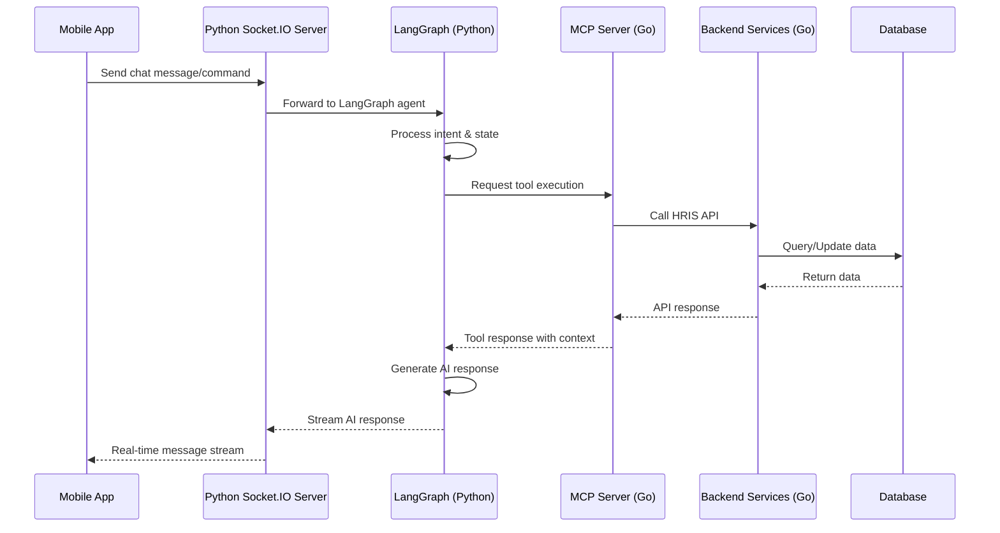
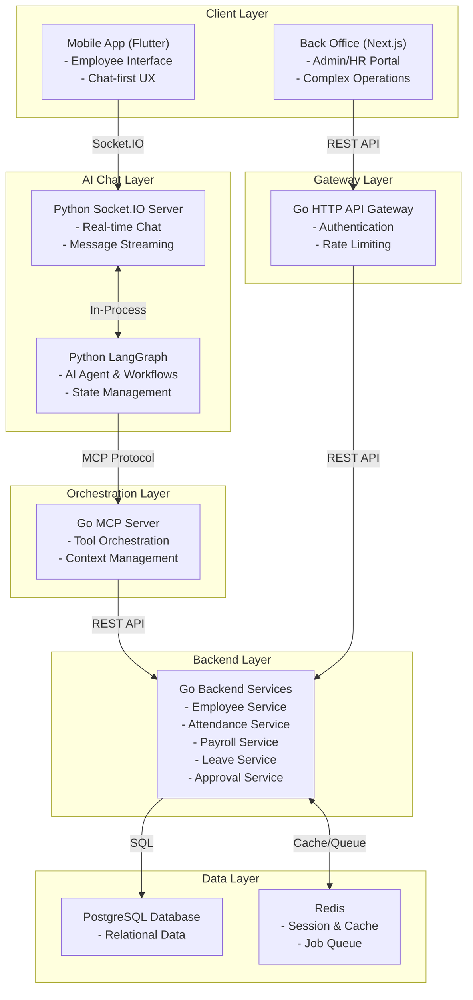

# Human Resource Information System (HRIS)

## Executive Summary

### Market Background

Traditional HRIS platforms suffer from poor user adoption due to complex interfaces requiring extensive training. Employees struggle with multi-step forms, confusing navigation, and finding the right features buried in menus. This friction leads to:
- Low employee engagement with HR systems (average 35% active usage)
- High support tickets for basic HR tasks (leave requests, policy questions)
- Delayed approvals due to manager interface complexity
- Wasted HR team time answering repetitive questions

**The Solution**: A chat-first HRIS that eliminates complexity through conversational AI. Employees interact naturally via chat commands like `/request-leave` or plain language like "I need 3 days off next week". This approach:
- **Reduces onboarding time** from days to minutes (no training needed)
- **Increases adoption** by leveraging familiar chat interfaces (Slack, WhatsApp patterns)
- **Accelerates workflows** with instant AI responses vs navigating complex UIs
- **Scales support** through 24/7 AI handling of common HR queries

### Core Platform Features

The HRIS provides AI-integrated solutions for:
- **Employee Management**: Complete employee lifecycle from onboarding to offboarding
- **Attendance & Time Tracking**: GPS-based clock in/out with offline capability, managed via chat commands
- **Payroll & Compensation**: Automated salary processing with tax calculations and compliance
- **Self-Service Portal**: Chat-first employee self-service for profile management and requests
- **Approval Workflows**: Conversational approval flows via notifications and chat interactions
- **Analytics & Reporting**: Comprehensive HR analytics with natural language query support
- **AI-Powered Assistant**: Conversational AI for HR queries, slash commands, and document intelligence

## AI Features

The system includes AI-powered capabilities to enhance user experience and automate HR operations:

### Conversational AI Assistant

#### Technology Stack
The chat-based service is built using a hybrid architecture:
- **AI Engine**: Python with LangGraph for conversational AI workflows, state management, and agentic orchestration
- **Communication Layer**: Go-based WebSocket server for real-time bidirectional communication between mobile clients and AI engine
- **MCP (Model Context Protocol)**: Go implementation for tool integration, context management, and HRIS service orchestration
- **Backend Services**: Go microservices for core HRIS functionality (attendance, payroll, leave management, employee data)

#### Architecture Flow

#### Features
| Feature | Complexity | Implementation Notes |
|---------|-----------|---------------------|
| Policy Queries | Easy | HR policy chatbot with static content and pre-defined Q&A using LangGraph flows |
| Leave Balance Check | Easy | Natural language queries for checking leave balance via MCP tool calls to Go HRIS API |
| Leave/PTO Requests | Medium | Conversational leave request submission with approval workflow integration via LangGraph state machines |
| Multi-language Support | Easy | Support for multiple languages using translation APIs (Google Translate, DeepL) |
| 24/7 Availability | Medium | Always-on AI assistant with infrastructure monitoring and maintenance |

**Reference**: https://www.lindy.ai/

## Problem Statement

Organizations face challenges in human resource management including:
- **Manual Attendance Tracking**: Time-consuming paper-based or basic digital attendance systems
- **Payroll Complexity**: Manual payroll calculations leading to errors and compliance issues
- **Approval Bottlenecks**: Inefficient leave and overtime approval processes
- **Data Fragmentation**: Employee information scattered across multiple systems
- **Limited Self-Service**: Employees dependent on HR for basic requests and information access
- **Reporting Gaps**: Lack of comprehensive HR analytics and insights

## Solution Overview

A comprehensive HRIS platform that automates and streamlines HR processes through:
- **Intelligent Attendance**: GPS-based attendance with offline synchronization
- **Automated Payroll**: End-to-end payroll processing with tax compliance and bulk slip generation
- **Digital Workflows**: Configurable approval workflows for leave, overtime, and reimbursements
- **Employee Self-Service**: Complete self-service portal for profile management and requests
- **HR Analytics**: Comprehensive HR dashboards with reporting capabilities
- **Mobile-First Design**: Native mobile applications for field employees and managers

## User Stories

### Admin/HR Role
- **Employee Management**: Full CRUD operations for employee data, department, job positions, and organizational structure
- **System Configuration**: Configure approval workflows, shift schedules, payroll parameters, and system settings
- **Payroll Processing**: Execute payroll runs, generate bulk salary slips, manage tax calculations and BPJS integration
- **Reporting & Analytics**: Access comprehensive HR reports, export data in multiple formats, and monitor system usage
- **Attendance Monitoring**: Oversee attendance patterns, manage exceptions, and configure attendance rules

### Manager/Supervisor Role
- **Team Management**: View and manage direct reports, monitor team attendance
- **Approval Workflows**: Approve leave requests, overtime applications, and reimbursement claims for team members
- **Team Analytics**: Access team-specific reports and attendance summaries
- **Schedule Management**: Configure team shift schedules and manage work arrangements
- **Team Monitoring**: Receive notifications for pending approvals and team attendance alerts

### Employee Role
- **Self-Service Portal**: Update personal information, emergency contacts, and banking details
- **Attendance Tracking**: Clock in/out using mobile app with GPS verification
- **Leave Management**: Submit leave requests, track approval status, and view leave balance
- **Payroll Access**: Download salary slips, view payment history, and access tax documents
- **Notifications**: Receive push notifications for approval updates, payroll notifications, and important announcements

## System Modules

The HRIS system is organized into nine core modules with clear separation of concerns:

1. **Authentication Module**
   - User authentication and session management
   - Role-based access control (RBAC)

2. **Data Master Module**
   - Branch and office management
   - Employee information management
   - Department and job position hierarchy
   - Role and permission management

3. **Attendance & Time Management Module**
   - GPS-based attendance tracking
   - Shift scheduling with rolling shifts support
   - Offline attendance with synchronization
   - Attendance monitoring and reporting

4. **Employee Self Service (ESS) Module**
   - Personal profile management
   - Document upload and management
   - Leave balance and history tracking
   - Payroll information access

5. **Payroll & Compensation Module**
   - Salary calculation engine
   - Tax computation (PPh 21) and BPJS integration
   - Bulk payroll processing
   - Salary slip generation and distribution

6. **Leave & Overtime Management Module**
   - Leave request workflows
   - Overtime calculation and approval
   - Leave balance tracking
   - Holiday calendar management

7. **Approval Workflow Module**
   - Configurable approval matrix
   - Multi-level approval chains
   - Notification system for approvals
   - Approval audit trails

8. **Reporting Module**
   - HR dashboard with key metrics
   - Attendance and payroll reports
   - Export capabilities (PDF, Excel, CSV)

9. **Notification Module**
   - Push notifications for mobile app

## Business Flows

### Attendance Check-in Flow

### Leave Request Approval Flow

## Feature Specifications

### Employee Service
- Employee CRUD operations with validation
- Department and job position management
- Employee onboarding and offboarding workflows
- Profile picture and document management
- Employee search and filtering capabilities

### Attendance Service
- GPS-based location validation
- Offline attendance synchronization
- Shift management and scheduling
- Attendance analytics and reporting
- Exception handling and approvals

### Payroll Service
- Salary calculation engine with configurable rules
- Tax computation (PPh 21) and BPJS integration
- Overtime and allowance calculations
- Bulk payroll processing with job queues
- Payslip generation and distribution
- Payroll audit trails and reporting

### Leave Service
- Leave balance calculation and tracking
- Leave request validation and processing
- Holiday calendar management
- Leave type configuration
- Integration with approval workflows
- Leave analytics and reporting

### Approval Service
- Configurable approval matrix
- Multi-level approval chains
- Approval delegation and substitution
- Audit trails for all approvals
- Integration with notification system
- Approval analytics and monitoring

## Attendance System

### Attendance Methods

#### Mobile Attendance
- GPS tracking for location-based verification
- Offline attendance with automatic synchronization
- Push notifications for attendance confirmation

#### Web-Based Attendance
- Browser geolocation API for location detection
- Requires active internet connection
- Web notifications for attendance confirmation

## Security Features

### Authentication & Authorization
- **Primary Authentication**: Email/username and password with bcrypt hashing
- **Session Management**: JWT tokens with refresh token rotation
- **Role-Based Access Control**: Super Admin, HR Admin, Manager, and Employee roles

### Data Security
- **Data at Rest**: AES-256 encryption
- **Data in Transit**: HTTPS/TLS 1.3 for all API communications
- **File Storage**: Server-side encryption for uploaded documents and images

### Privacy Compliance
- **GDPR Compliance**: Right to erasure, data portability, and consent management
- **Data Minimization**: Collect only necessary employee information
- **Audit Logging**: Comprehensive audit trails for all data access and modifications
- **Data Retention**: Configurable data retention policies with automatic purging
- **Anonymization**: Employee data anonymization for reporting and analytics

### Application Security
- **Input Validation**: Comprehensive validation and sanitization of all inputs
- **SQL Injection Prevention**: Parameterized queries and ORM-level protection
- **XSS Protection**: Content Security Policy (CSP) and output encoding
- **CSRF Protection**: Double-submit cookie pattern and SameSite attributes
- **Rate Limiting**: API rate limiting to prevent abuse and DDoS attacks

## Technology Stack

### Backend Services
- **Programming Language**: Go (Golang)
- **Framework**: Fiber or Gin for HTTP REST APIs
- **Database**: PostgreSQL for relational data storage
- **Cache & Message Queue**: Redis for session management, caching, and async job processing

### AI Chat Service
- **AI Framework**: Python with LangGraph for conversational AI workflows and state management
- **Real-time Server**: Python Socket.IO server for real-time bidirectional communication with clients
- **MCP Server**: Go implementation for tool orchestration, context management, and HRIS service integration
- **LLM Provider**: OpenAI GPT-4.1-mini for cost-effective conversational AI

### Mobile Application
- **Framework**: Flutter for cross-platform mobile development (iOS & Android)
- **State Management**: Riverpod or Provider for reactive state management
- **Real-time Communication**: Socket.IO client for chat interface
- **Local Storage**: SQLite for offline relational data and Hive for key-value storage
- **Push Notifications**: Firebase Cloud Messaging (FCM)

### Frontend Back Office (Admin/HR Portal)
- **Framework**: Next.js for web-based administration portal with SSR/SSG capabilities
- **State Management**: Zustand or Redux Toolkit for complex state handling
- **UI Library**: shadcn/ui or Ant Design for enterprise-grade components
- **Data Tables**: TanStack Table for complex data grids with sorting, filtering, pagination
- **Charts & Analytics**: Recharts or Chart.js for HR dashboards and reporting
- **Form Management**: Zod validation with form libraries for complex forms
- **API Client**: TanStack Query for REST API communication with Go backend
- **Authentication**: NextAuth.js for session management and authentication flows

**Purpose**: Handles complex administrative tasks that require detailed UI/UX and are not suitable for conversational AI:
- Bulk employee data import/export (CSV, Excel)
- Complex payroll configuration (tax brackets, BPJS settings, allowance rules)
- Detailed approval matrix configuration with multi-level hierarchies
- Advanced reporting with custom filters, date ranges, and export options
- Organization structure management (departments, positions, reporting lines)
- System configuration (shift schedules, leave policies, holiday calendars)
- Audit logs and compliance reporting
- Batch operations (bulk approvals, mass employee updates)

### Infrastructure
- **Containerization**: Docker for all services
- **Orchestration**: Docker Compose for local development and deployment
- **CI/CD**: GitHub Actions or GitLab CI for automated testing and deployment
- **Monitoring & Error Tracking**: Sentry for application monitoring, error reporting, and performance tracking
- **Logging**: Structured JSON logging with centralized collection via Sentry

### API Architecture

## Glossary

- **HRIS**: Human Resource Information System - Comprehensive software for managing employee information and HR processes
- **ESS**: Employee Self Service - Portal allowing employees to manage their own information and requests
- **RBAC**: Role-Based Access Control - Security model that restricts access based on user roles
- **JWT**: JSON Web Token - Standard for securely transmitting information between parties
- **PPh 21**: Indonesian income tax regulation for employee salaries
- **BPJS**: Indonesian social security system for healthcare and employment
- **PWA**: Progressive Web App - Web applications with native app-like features
- **FCM**: Firebase Cloud Messaging - Cross-platform messaging solution for push notifications
- **LangGraph**: Python framework by LangChain for building stateful, multi-actor applications with LLMs using graph-based workflows
- **MCP**: Model Context Protocol - Standard protocol for connecting AI models to external tools, data sources, and services